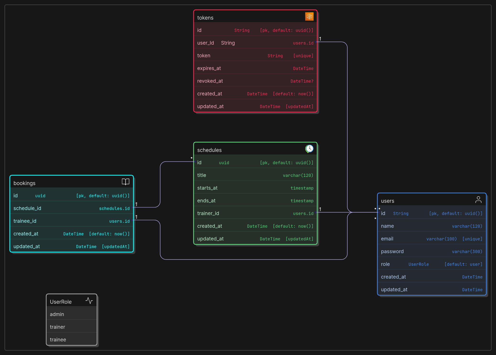

# Gym Scheduling and Management System

[](https://github.com/imashiksarkar/Gym-Scheduling-and-Management-System-Backend/actions/workflows/test.yml)

[Live Link](https://gsms-api.ashiksarkar.xyz)

Gym Class Scheduling &amp; Membership System with Admin, Trainer, and Trainee roles. Admins schedule up to 5 classes/day, assign trainers; trainees can book classes (max 10 per class) and manage profiles. Secure JWT authentication and error handling ensure smooth, role-based gym management.

## ER Diagram



## 🛠️ Used Technologies

- Node.js
- Express.js
- Vitest
- Supertest
- TypeScript
- Prisma
- PostgreSQL
- Zod
- JWT
- Docker
- Docker Compose
- Postman

## 📖 Setup Guide

1. Clone the repository: `git clone https://github.com/ashiksarkar/gsms-backend.git`
2. Install dependencies: `pnpm install`
3. Put DB_URL in `.env` that is running
4. Start the server: `pnpm run dev`

**_Docker Guide_**

```bash
  # for dev
  $ pnpm i
  - start docker
  $ pnpm setup # run a test database in your docker also start prisma studio
  - put DB_URL in .env
  $ pnpm run dev
  - or
  $ pnpm run test # for tdd

  # for prod
  $ docker run --env-file .env -p 3000:3000 imashiksarkar/gsms:1.1.0
  # follow the .env.example
```

## 📡 API Endpoints

[Postman Collection](./docs/postman-collection.json)

```json
// admin credentials
{
  "name": "John Doe",
  "email": "john@example.com",
  "password": "Aa@6mk"
}
```

### Auth Module

- [x] signup as trainee `POST /auth/signup`
- [x] user can signin `POST /auth/signin`
- [x] fetch own profile `GET /auth/profile`
- [x] refresh token `GET /auth/refresh`
- [x] signout `DELETE /auth/signout`
- [x] fetch all allowed roles `GET /auth/roles`

- **Role: Admin**
  - [x] fetch all users `GET /auth/users`
  - [x] fetch a single user `GET /auth/users/userId`

---

### Trainer Module

- [x] list all trainers `GET /trainers`
- [x] get a single trainer `GET /trainers/:trainerId`
- [x] list trainer schedules `GET /trainers/:trainerId/schedules`

- **Role: Admin**

  - [x] create trainer `POST /trainers`
  - [x] delete trainer `DELETE /trainers/:trainerId`

- **Role: Trainer**
  - [x] get own schedules as trainer `GET /trainers/schedules`

---

### Schedule Module

- [x] list all schedules `GET /schedules`
- [x] list all available schedules `GET /schedules/available` <!-- also that is not booked by more that 10 trainees -->
- [x] get a single schedule `GET /schedules/:scheduleId`
- [ ] get trainees who booked the schedule `GET /schedules/:scheduleId/trainees`

- **Role: Admin**

  - [x] create schedule `POST /schedules`
  - [x] update trainer of a schedule `PATCH /schedules/:scheduleId`
  - [x] delete schedule `DELETE /schedules/:scheduleId`
  - [ ] get trainees who booked a schedule `GET /schedules/:scheduleId/trainees`

- **Role: Trainee**
  - [ ] check if schedule is full (trainee-side) `GET /schedules/:id/status`

---

### Booking Module

- **Role: Trainee**

  - [x] book a schedule `POST /bookings` // max 10 trainee can book per schedule

  ```json
  // input payload
  {
    "scheduleId": "",
    "traineeId": ""
  }
  ```

  - [x] list own bookings `GET /bookings`
  - [x] get a single booking `GET /bookings/:bookingId`
  - [x] cancel booking `DELETE /bookings/:id`

- **Role: Admin**
  - [x] list all bookings `GET /bookings`
  - [x] get a single booking `GET /bookings/:bookingId`

---

## Schemas

```javascript
enum UserRole {
  admin
  trainer
  trainee
}

model User {
  id        String   @id @default(uuid())
  name      String   @db.VarChar(120)
  email     String   @unique @db.VarChar(100)
  password  String   @db.VarChar(300)
  role      UserRole @default(trainee)
  createdAt DateTime @default(now()) @map("created_at")
  updatedAt DateTime @updatedAt @map("updated_at")

  tokens   Token[]
  Schedule Schedule[]
  Booking  Booking[]

  @@map("users")
}

model Token {
  id        String    @id @default(uuid())
  userId    String    @map("user_id")
  token     String    @unique
  expiresAt DateTime  @map("expires_at")
  revokedAt DateTime? @map("revoked_at")
  createdAt DateTime  @default(now()) @map("created_at")
  updatedAt DateTime  @updatedAt @map("updated_at")

  user User @relation(fields: [userId], references: [id], onDelete: Cascade)

  @@index([token], name: "token_idx")
  @@index([userId], name: "user_id_idx")
  @@map("tokens")
}

model Schedule {
  id        String   @id @default(uuid())
  title     String   @db.VarChar(120)
  startsAt  DateTime @map("starts_at")
  endsAt    DateTime @map("ends_at")
  trainerId String   @map("trainer_id")
  createdAt DateTime @default(now()) @map("created_at")
  updatedAt DateTime @updatedAt @map("updated_at")

  trainer User      @relation(fields: [trainerId], references: [id], onDelete: Cascade)
  Booking Booking[]

  @@map("schedules")
}

model Booking {
  id         String   @id @default(uuid())
  scheduleId String   @map("schedule_id")
  traineeId  String   @map("trainee_id")
  createdAt  DateTime @default(now()) @map("created_at")
  updatedAt  DateTime @updatedAt @map("updated_at")

  schedule Schedule @relation(fields: [scheduleId], references: [id], onDelete: Cascade)
  trainee  User     @relation(fields: [traineeId], references: [id], onDelete: Cascade)

  @@unique([scheduleId, traineeId])
  @@map("bookings")
}
```

## Response Structures

```json
// success output
{
  "success": true,
  "code": 200,
  "status": "Ok",
  "data": {}, // object or array
  "message": [""], // optional
}

// error output
{
  "success": false,
  "code": 401,
  "status": "Unauthorized",
  "error": {
    "fields": { // optional
      "email": ["Email is required"], // optional
      "password": ["Password is required"]
      },
    "message": ["Invalid credentials"]
  }
}

// error output
{
  "success": false,
  "code": 409,
  "status": "Conflict",
  "error": {
    "message": [
      "You can't create more than 5 schedules per day."
    ]
  }
}
```
